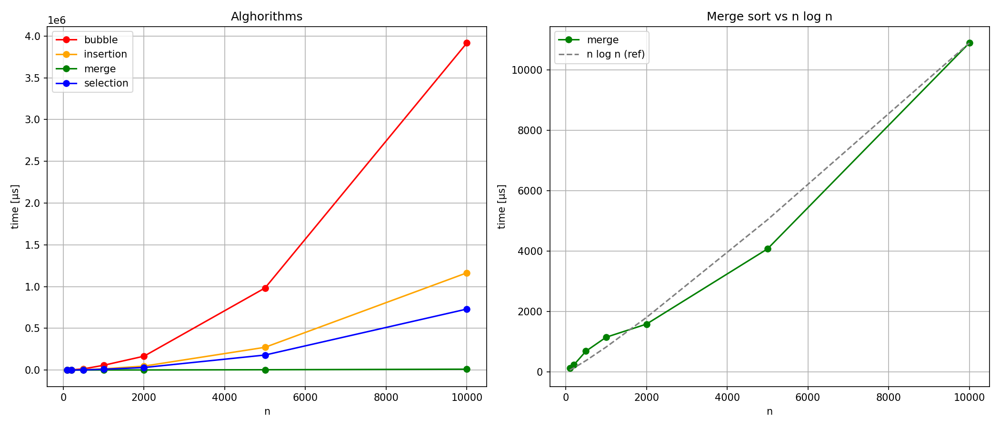

# Data Structures, Algorithms & ADT Playbench

## Build Sequence

## Dir Structure

## Abstract Data Types

## Searching Algorithms

|Algorithm|avg time|worst time|best time|space|
|:-------:|:-------:|:-------:|:-------:|:-------:|
|Linear Search|O(n)|O(n)|O(1)|O(1)

 
## Sorting Algorithms

|Algorithm|avg time|worst time|best time|space|
|:-------:|:-------:|:-------:|:-------:|:-------:|
|Bubble Sort|O(n2)|O(n2)|O(n)|O(1)|
|Selection Sort|O(n2)|O(n2)|O(n2)|O(1)|
|Insertion Sort|O(n2)|O(n2)|O(n)|O(1)|
|Merge Sort|O(nlog(n))|O(nlog(n))|O(nlog(n))|O(n)|

  

before build:
sudo apt install libgtest-dev

cd build
cmake ..
cmake --build .

./stack_test

